<<<<<<< HEAD
# Introduction 

This repository (repo) will show you some of my projects that I have been working on. And here is a brief introduction.
#  
### Data Visualization and Reporting Projects

+ **Project 1. Data Visualization - An Interactive Ad-hoc Report** 
  
  A quick video will show you an ad hoc report generated by using [DOMO](https://www.domo.com/) (a very similar tool as Tableau). Data is pulling from Microsoft SQL server which is part of the ELT process.
  
 
+ **Project 2. Project Summary Report Automation** 
  
  This is a report automation project. A quick video will show you how to generate a project in both Powerpoint and PDF format by a simple click. 
  
  The two main techniques used in this project are Microsoft SQL and Python UDF (User-defined Function). The excel template connects to the SQL server to get data/query updated. What's more, the excel UDF will enable us to 
  run the backend Python code to generate the report in a designed structure automatically.
  
  
+ **Project 3. Sensitivity Analysis** 

    1) What is sensitivity analysis
        
       A sensitivity analysis determines how different values of an independent variable affect a particular dependent variable under a given set of assumptions. In other words, sensitivity analyses study how various sources of uncertainty in a mathematical model contribute to the model's overall uncertainty [[1]](https://www.investopedia.com/terms/s/sensitivityanalysis.asp). 
       
    2) What's the end goal of this project
    
       As a investor, we want to know how will our IRR (Internal Return Rate) change with the change of some related factors such as market growth rate, expense growth rate, loan rate, and etc.
       
       The main techniques used in this project is Python xlwings and pandas packages.
#  

### Statistical Modelling/Machine Learning/AI Projects
  TBD...Stay tuned
#  
=======
# Performance Report Template 

This repo will show you how to install all the programs to run the Performance Report Template. 
After following the instructions, you can generate the performance report automatically with a single click.

Here is a quick demo.

## Setup Instructions

+ **Step 1 Find your Operating System Type** 
 
  First of all, we need to check what operating system type you have for your computer so that we can pick the correct python version. 
  
  1) Type "This PC" in the search bar on the left bottom of your desktop;
     
     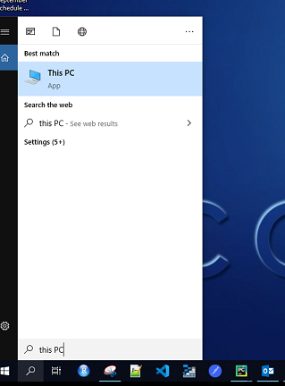  
      
  2) Right click on the "This PC" icon and left click on the "Properties" option;
  
     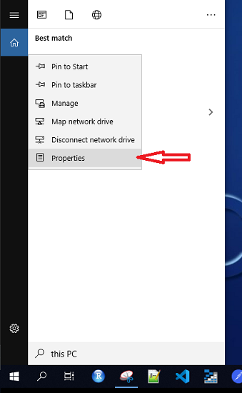
  
  3) Find your operating system type;
  
     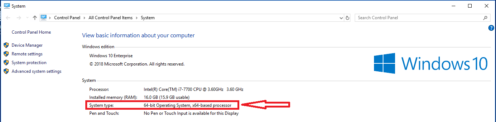
     
     
+ **Step 2 Download the Anaconda package** 
  
  Go to the [Anaconda](https://www.anaconda.com/distribution/#download-section) and download the one with the Python 3.* version. 
  Recall your operating system type (if you forget what operating system type you have, go back to Step 1). 
  If you have the 64-bit Operating System, then download the 64-Bit Graphical Installer package. 
  Otherwise, download the 32 Bit version.
  
     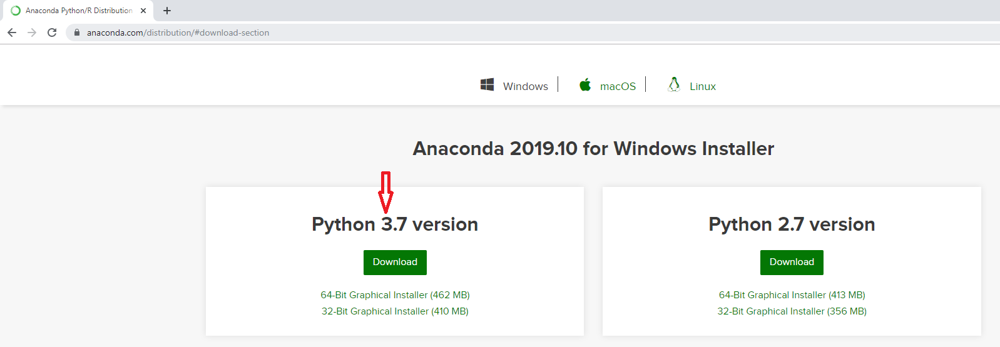
     
+ **Step 3 Install the Anaconda package** 
     
    Find the Anaconda installation package on your computer and follow the steps to install it.

    1) Click on the "Next";
    
       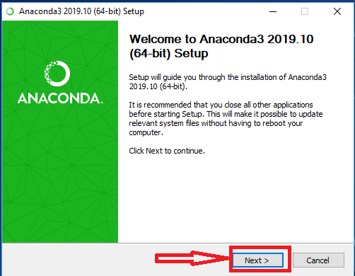

    2) Click on "Agree";
    
       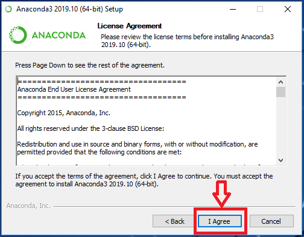
       
    3) Keep the "Just Me" default option and then click on the "Next";
    
       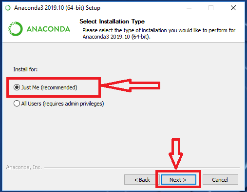
      
    4) Keep the default Destination Folder and then click on the "Next";
    
       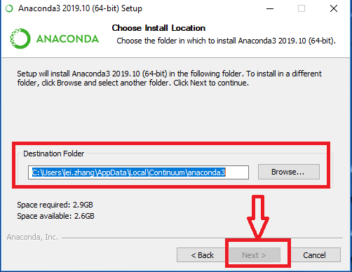
    
    5) Click on the "Add Anaconda to my PATH environment variable" option and then click on the "Install";
    
       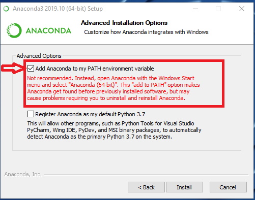
    
+ **Step 4 Test if the Anaconda package is installed successfully** 
    
    1) Type "powershell" in the search bar on the left bottom of your desktop and then click on the icon to launch the program;
    
        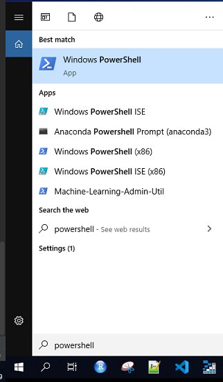

    2) Type "Conda --version" in the Powershell. If you can get something back like "conda 4.*.*", it means you have installed the Anaconda successfully.
       
       Otherwise, redo the Step 3 to reinstall the Anaconda package.
    
       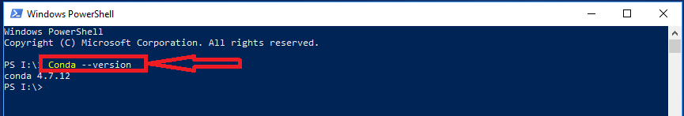

+ **Step 5 Download and install the xlwings addin** 
    
    1) Go to the [xlwings addin download page](https://github.com/xlwings/xlwings/releases) and download the latest version of .Xlam package;
       
       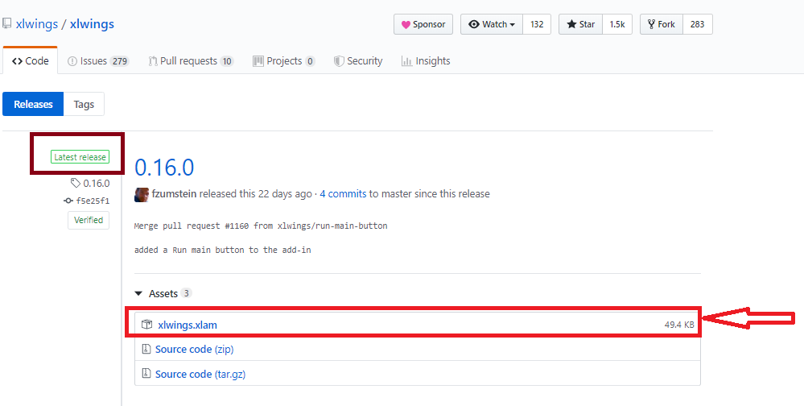

    2) Go to the C:\Users\\(your username)\AppData\Roaming\Microsoft\AddIns and make a copy of the xlwings package into the folder;
       
       Your username will be your firstname.lastname, e.g. lei.zhang.
       
       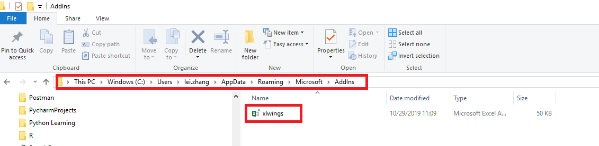
    
    3) Open any excel file (new excel file is also fine). Go to File -> Options -> Add-ins -> Go -> Browse.. -> click on the xlwings 
       
       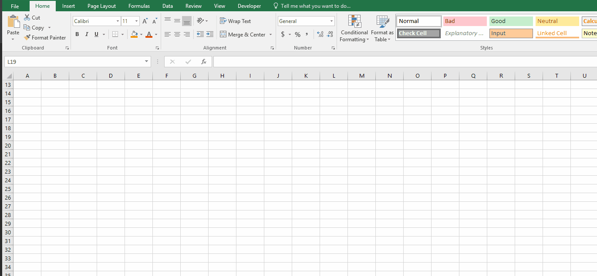
    
       After this step, you should be able to find the xlwings tab on the top of the file. And make a note of the xlwings version you have just installed. 
       In this example, I got the version 0.16.0. We will update the python xlwings package and match with the xlwings addin version in the nex step.
       
       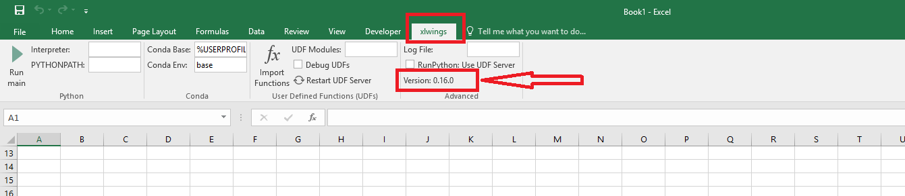
       
    4) You can skip this step if you got the xlwings tab. If you can't get the addin in your excel, please do the followings;
       
       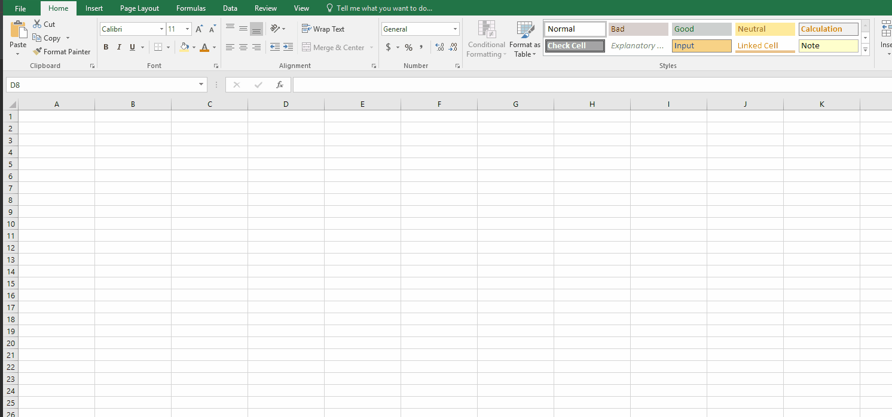
       
    5) Trust access to VBA
    
       Go to File tab -> Options -> Trust Center -> Trust Center Settings -> check the "Trust access to the VBA project object model"
        
       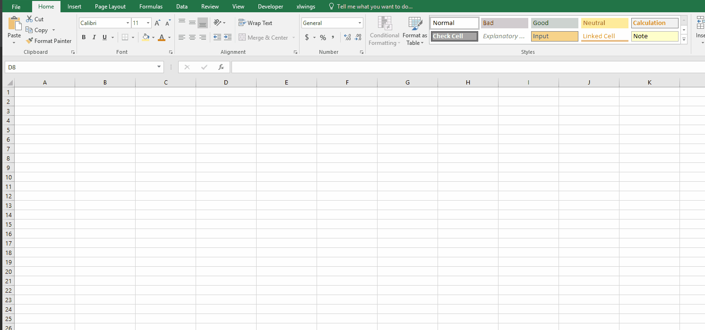
      
    6) Set the xlwings reference in the Developer
        
       Go to Developer tab -> Visual Basic -> Tools -> Reference -> check the xlwings 
       
       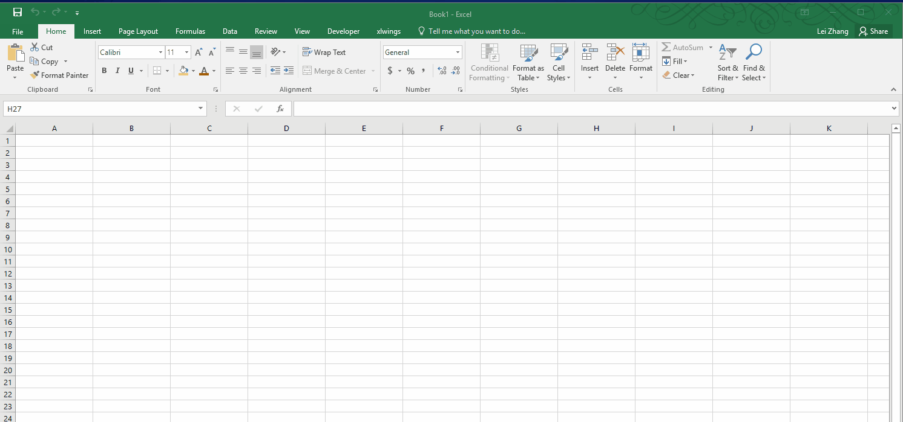
       
    7) Change the Conda Base and Conda Environment 
       
       Go the Xlwings tab -> put "%USERPROFILE%\AppData\Local\Continuum\anaconda3" (without the quotation mark) in the Conda Base
                          -> put "Based" (without the quotation mark) in the Conda Env
    
       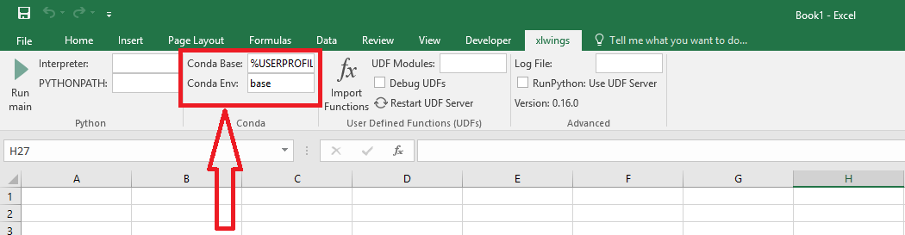 
        
+ **Step 6 Update the Python xlwings package**        
    
    Go to the Poweshell and type "conda install xlwings==(your xlwings add-in version)" (without the quotation mark)
    
    In this example, we know that we have the version 0.16.0, so the snytax should be "conda install xlwings==0.16.0" 
    (without the quotation mark). If you are not sure what's xlwings add-in version you have, go back to Step 5 III.
    
    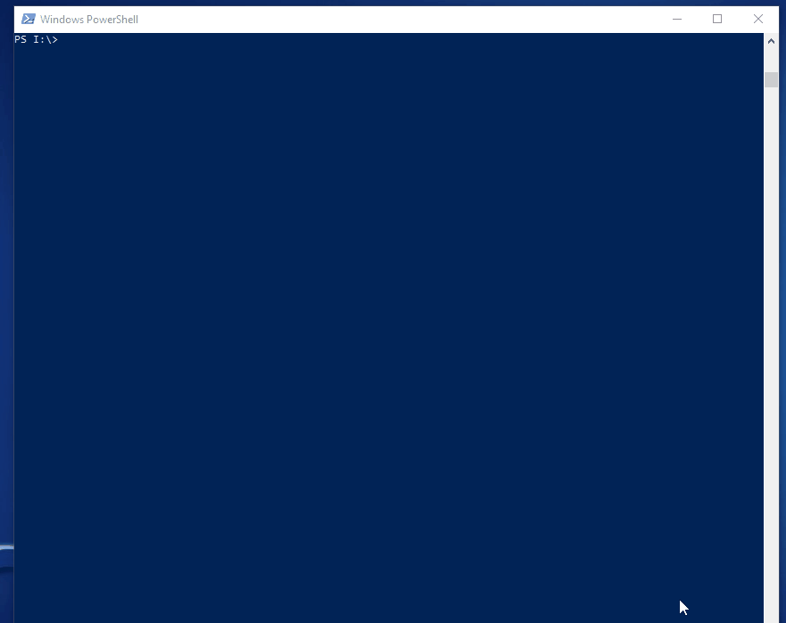
  
    Go back to he Powershell and check if the xlwings is updated. Type "conda list" (without the quotation mark) and find the xlwings 
    version in the list.
    
    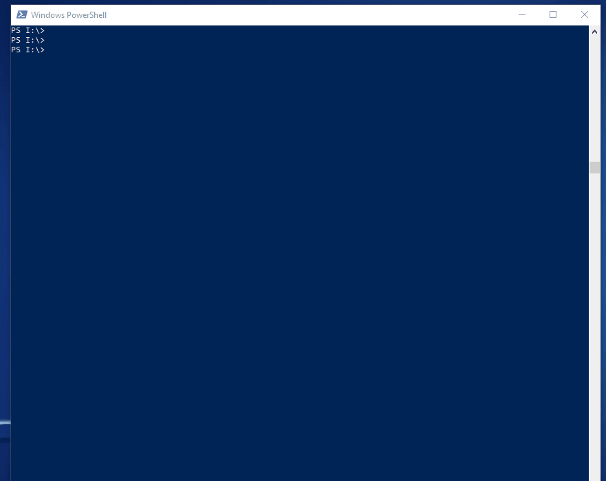
     
     
+ **Step 7 Install the Investment-model-utils** 

    1) Clone the [Investment-model-utils](https://github.com/cortlandpartners/investment-model-utils)
    2) Make a copy of the folder to  C:\Users\\(your username)\AppData\Local\Continuum\anaconda3\Lib\site-packages
    
   You should be good to go now. 

+ **Step 8 Run the template** 
   
    
   
   
   When you run the template if you have something complaining about the comtypes package like below, do the following steps,
   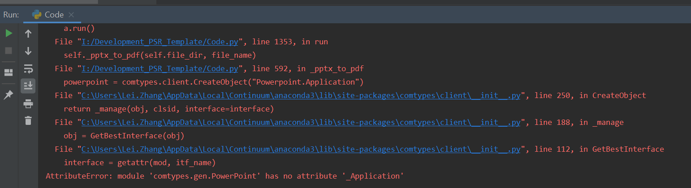
    
    1) Go to the folder C:\Users\\(your username)\AppData\Local\Continuum\anaconda3\Lib\site-packages\comtypes\gen
    2) Delete all the files within this folder
    3) Run the template again

   

   
>>>>>>> release/1.4.0
